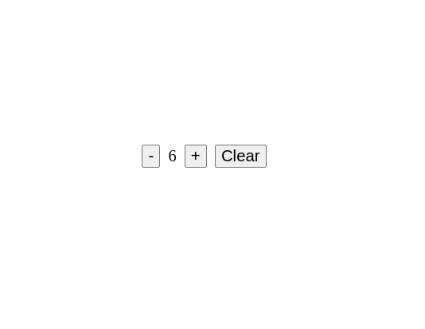

# Демо счетчика, написанного согласно паттерну MVC

На главной странице есть счетчик. И три кнопки. Первая кнопка уменьшает значение счетчика, вторая увеличивает,
а третья сбрасывает значение на дефолтное (в данном случае на ноль).

Так как данные хранятся в локальном хранилище, при перезагрузке значение счетчика не сбрасывается.

Счетчик состоит из:

-   CounterView - класс отвечающий за представление. Хранит в себе методы по отрисовке и обновлению html элементов. Так же CounterView регистрирует события сlick.

-   CounterModel - модель. Не имеет собственного состояния, синхронно берет или сохраняет данные в localStorage. Так же является отказоустойчивым. При получении невалидного значения из localStorage возвращает дефолтное значение.

-   CounterController - контроллер. Инициализирует модель и представление. Устанавливает связь между обработкой события сlick и записью данных в модель. Так же в нем описано как именно мы хотим изменить данные.
